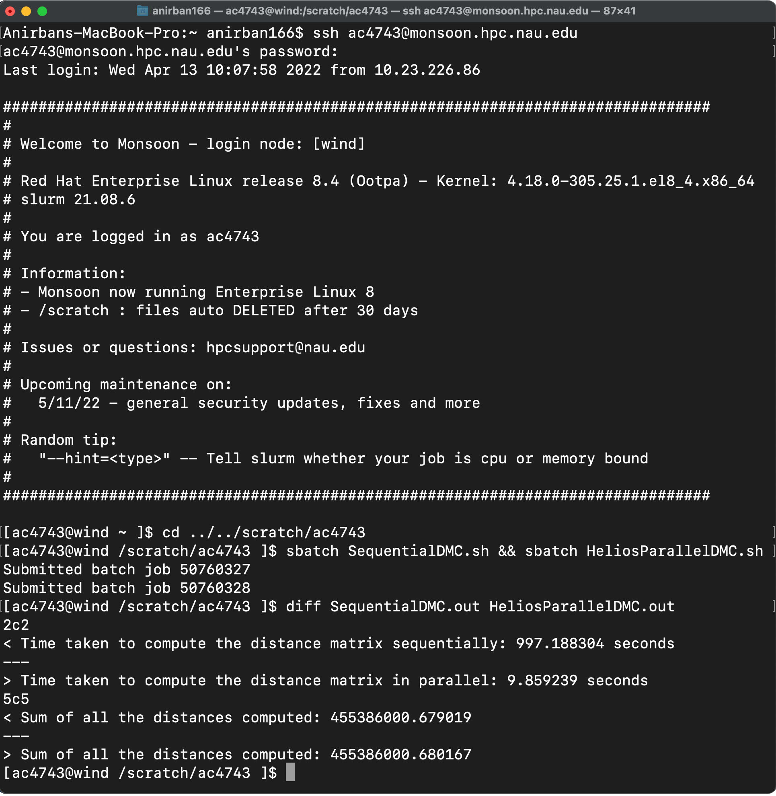

<p align = "center">

</p>

---
<h2 align = "center">
Functionality
</h2>

Helios offers high-performance distance matrix computation that utilizes both shared-memory (threads) and distributed memory (processes across cores) parallelism.

---
<h2 align = "center">
Features
</h2>

Core features include tiling the distance matrix (allows 2D tile-based accesses instead of the regular row-wise approach) for better cache utilization (or improvement in spatial locality) and a hybrid setup of multiple OpenMP threads and MPI processes to run the distance matrix computations in parallel.

---
<h2 align = "center">
Notes
</h2>

Note that small to medium tile sizes are usually preferable, depending upon the cache size in your machine (for instance, a tile length of 5000 and over would be overkill, given that it would exceed the ordinary cache size). The very idea of a tiled approach is to be able to re-use the cached entries for each object, and since the objects in such computational problems are considerably large (mostly due to the high dimensionality, for instance computations across 90 doubles are in play for each inner loop iteration when dealing with the Million Song dataset), a smaller tile size will be much more performant than a larger one. The improvement in cache hits or the decrease in cache misses (as reported by perf for each process) can be seen from the drop for the ratio of the latter is to the former metric (cache misses/cache hits, and times a hundred for the percentage) when compared against the regular version with row-based ingress. 

Also note that the tiled solution is in fact, an optimization, and optimizations often reduce the room for parallelization, or make it less effective (i.e., it reduces the parallel scaling, as can be observed by evaluating the speedup). There are several other trivial optimizations that I can think of (but are not incorporated here for the same reason), such as for instance, exactly N (size of the dataset, or the number of lines in it) elements will be zero across the diagonals (or at i equals j for two nested loops that run through the matrix elements, with loop variables i and j) and at least half of the rest will be duplicates, so I can precompute the diagonals and just compute one half of the rest elements in the matrix. Avoiding this allows me to have more work, which in turn allows my parallelization to scale better (with increasing core count).

---
<h2 align = "center">
Performance
</h2>

Upon tests on the [Million Song dataset](https://github.com/Anirban166/Helios/blob/main/Miscellaneous/Million%20Song%20Dataset%20(Normalized%2C%20upto%20100k%2C%2090%20dimensions).txt) with 10<sup>5</sup> lines (or a generated distance matrix of size 10<sup>10</sup>) of floating point data, Helios achieved more than hundred times the performance of the sequential version (one without any form of parallelism) with a tiled (500 x 500) distance matrix computation handled by 64 processes each tied to a separate CPU core (from an AMD Rome processor), with four threads per core. (with multithreading within a process, all threads can share the dataset and re-use portions of it from the cache) 

<p align = "center">

</p>

Note that this has been tested on a compute cluster. A caveat here would be to not run this computation on a typical laptop, given that it requires around 75 GiB of main memory (10<sup>5</sup>\*10<sup>5</sup>\*8/1024/1024 = 76k MiB or ~74.5 GiB) to store the dataset. Another thing to look out for here would be to avoid the use of excessive threads, since a large number of threads (or even processes, as the parallel efficiency decreases after a certain threshold and more datasets have to be created for increasing number of process ranks) is not always beneficial. This is an empirically proven statement based on experimental observations, and would apply with the maximum number of threads possible on other compute systems, taking into account or inclusive of hardware threads (i.e., with hyper-threading). Distribution of MPI ranks across nodes and sockets could potentially make it scale better or worse, depending upon the setup of your compute facility and how you allocate resources.

---
<h2 align = "center">
Compilation
</h2>

Compile using the highest optimization level (same agenda followed with the sequential version for a fair comparison) to save some time (unless you can generate optimal assembly or machine language from my code) and explicitly link the maths library in case it isn't being tied together: (if you happen to encounter undefined references to functions from `math.h` like the call to `sqrt()` that is being used) 

```sh
mpicc -O3 -fopenmp Helios.c -lm -o Helios
```
This would be good to go in any Linux machine, or most cluster-based environments (one I tested on uses Slurm for reference) while using gcc. But note that Apple's Clang by default doesn't support OpenMP (and thus, `-fopenmp` would be a foreign element), so for OS X users (looking at the mirror), install LLVM (Clang is one unit among their compiler toolchain) and libomp (append `-lomp` when compiling) via a package manager like Homebrew. (throw `brew install llvm lomp` in the terminal, prior to grabbing some popcorn and waiting under a mutex lock till the operation called installation is done with, although there's no point in atomicity here)

---
<h2 align = "center">
Execution
</h2>

The program takes as input five command line arguments (apart from the executable, naturally), which are in order, the number of lines in the dataset, the dimensionality of it, the tile size, the thread count and the name of the dataset or the full path to it (if not in the current directory of access). Supply these arguments to `mpirun` after specifying the process count and the hostfile: <br>
<br>

```sh
mpirun -np <processcount> -hostfile <hostfilename>.<hostfileextension> ./Helios <numberoflines> <dimensionality> <tilesize> <filename> <threadcount>
```
Simply creating a text file that specifies the localhost slots to designate the maximum number of processes possible ([example](https://github.com/Anirban166/Helios/blob/main/Miscellaneous/Example%20Host%20File.txt)) will do for the hostfile.

If you're using a compute cluster (looks at the mirror again) that uses Slurm, use `srun` instead of `mpirun`, and switch accordingly based on your scheduler.