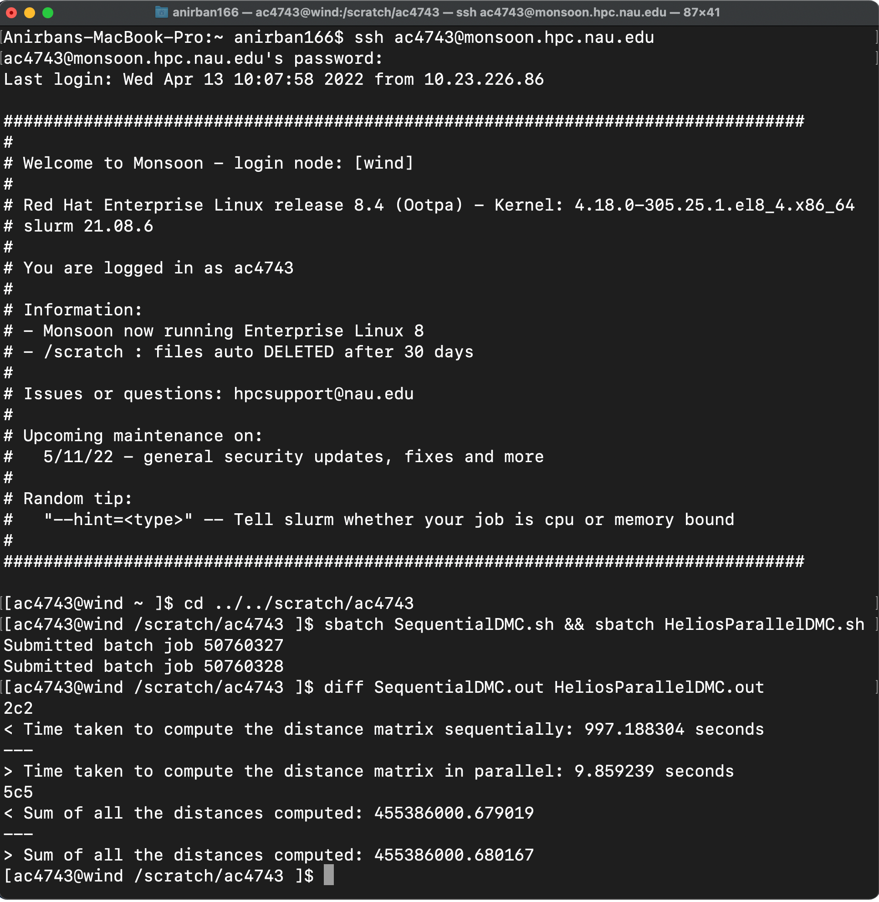

<p align = "center">

</p>

---
<h2 align = "center">
Nani?
</h2>

A tool for high-performance distance matrix computation that leverages both shared (threads) and distributed (processes across cores) memory parallelism. It involves tiling the input matrix (enabling 2D tile-based access over the regular row-wise pattern) for better cache utilization (or improvement in spatial locality) and a hybrid setup of multiple OpenMP threads and MPI processes for efficiently running the computations in parallel.

---
<h2 align = "center">
Performance
</h2>

Upon tests on the [Million Song dataset](https://github.com/Anirban166/Helios/blob/main/Miscellaneous/Million%20Song%20Dataset%20(Normalized%2C%20upto%20100k%2C%2090%20dimensions).txt) with 10<sup>5</sup> lines of floating point data (or a generated distance matrix of size 10<sup>10</sup>), Helios achieved more than hundred times the performance of the sequential version (one without any form of parallelism; both were compiled using the highest optimization level for a fair comparison) with a tiled (500 x 500) distance matrix computation handled by 64 processes (each tied to a separate CPU core from an AMD Rome processor), with four threads per core (given multithreading within a process, all threads share the dataset and re-use portions of it from the cache).

<p align = "center">

</p>

> This has been tested on a compute cluster. A caveat here would be to not run this computation on an ordinary laptop, given that it requires around 75 GiB of main memory (10<sup>5</sup>\*10<sup>5</sup>\*8/1024/1024 = 76k MiB or ~74.5 GiB) to store the dataset. Another thing to look out for would be to avoid the use of excessive threads, since a large number of threads (or even processes, as the parallel efficiency decreases after a certain threshold and more datasets will be created as the number of process ranks increases) is not always beneficial. This is an empirically proven statement based on experimental observations, and would easily be applicable for the maximum number of threads possible on other compute systems (taking hardware threads into account, or inclusive of hyper-threading). Distribution of MPI ranks across nodes and sockets could potentially make it scale better or worse, depending upon the setup of your compute facility and how you allocate resources.

---
<h2 align = "center">
Setup
</h2>

Compile using the highest optimization level to generate the most efficient machine code for Helios. Explicitly link the math library to resolve any undefined references to functions from `math.h`: (such as the call to `sqrt()` that is being used in my code)

```sh
mpicc -O3 -fopenmp Helios.c -lm -o Helios
```
This should be good to go on any Linux machine, or most cluster-based environments (the one I tested on uses Slurm for reference) when using `gcc`. But note that Apple Clang doesn't support OpenMP by default (and thus, `-fopenmp` would be a foreign element), so for OS X users (*looks at the mirror*), install LLVM (Clang is a part of their compiler toolchain) and `libomp` (append `-lomp` when compiling) via a package manager like Homebrew. (Drop `brew install llvm lomp` in the terminal, prior to grabbing some popcorn and waiting under a mutex lock till the operation called installation is done with, despite the need for atomicity)

---
<h2 align = "center">
Execution
</h2>

The program takes as input five command line arguments (apart from the executable), which are in order: The number of lines in the dataset, the dimensionality of it, the tile size, the thread count, and the name of the dataset or the full path to it (if not in the current directory of access). Supply these arguments to `mpirun` after specifying the process count and the hostfile:

```sh
mpirun -np <processcount> -hostfile <hostfilename>.<hostfileextension> ./Helios <numberoflines> <dimensionality> <tilesize> <filename> <threadcount>
```
Simply creating a text file that specifies the localhost slots to designate the maximum number of processes ([example](https://github.com/Anirban166/Helios/blob/main/Miscellaneous/Example%20Host%20File.txt)) will do for the hostfile.

If you're using a compute cluster (*continues staring into the mirror*) that uses Slurm, use `srun` instead of `mpirun`, and switch commands accordingly based on your scheduler. Parameters for clusters would vary, but for `#SBATCH` prefixed options, here are some insights based on my specifications:
```sh
--time=00:01:00       # How long do you estimate the computation to run? Go a few seconds above that value to be safe (or to avoid timeouts)
--mem=80000          # Emplace a reasonable value for the memory (in MiB) you would want to allocate (which again, depends upon your rough calculations)
--nodes=1           # Specify the node count (use if you're familiar with distribution of ranks across nodes; I'd append --nodes=$nodeCount --ntasks-per-node=$ranksPerNode to srun to avoid discrepancies)
-C amd             # Specify the processor type
-c 64             # Specify the number of threads you would want per task
--ntasks=64        # Specify the number of process ranks or tasks
--exclusive         # Get the entire node (or nodes) for yourself (hard requisite for greedy ones :)
--cpus-per-task=1    # Specify the number of CPU cores allotted per MPI process/task
--ntasks-per-socket=1 # Specify number of MPI ranks to place per socket
```
MPI ranks can be tied to nodes and sockets as well (one per each), so there is plenty of room for customization.

Feel free to experiment with different combinations of processes and threads. For example, here's a stub to test with different process counts whilst keeping the tile size and thread count fixed:
```sh
threadCount=2
# Declare an array to hold different process counts:
declare -a processCount=(2 4 8 12 16 20 30 40 50 64)
# Extract the length of it in a variable:
arrayLength=${#processCount[@]}
# Loop through the different process counts and execute Helios:
for((i = 0; i < ${arrayLength}; i++)); 
do    
  echo -e "\nRunning the distance matrix computation with ${processCount[$i]} processes, 2 threads per process and a tile size of (500 x 500):"
  srun -n${processCount[$i]} ./Helios 100000 90 500 MillionSongDataset.txt $(threadCount)
done
```
Similarly, tile sizes can be tweaked to find the sweet spot for your dataset or particular use case:
```sh
threadCount=2
processCount=64
declare -a tileSize=(25 100 500 1000 2000)
arrayLength=${#tileSize[@]}
for((i = 0; i < ${arrayLength}; i++)); 
do    
  echo -e "\nRunning the distance matrix computation with 64 processes, 2 threads per process and a tile size of (${tileSize[$i]} x ${tileSize[$i]}):"
  srun -n$(processCount) /usr/bin/perf stat -B -e cache-references,cache-misses ./Helios 100000 90 ${tileSize[$i]} MillionSongDataset.txt $(threadCount)
done
```
> I'm using the `perf` tool above to obtain metrics such as the cache references and misses (which are then written to a file using `stderr` to not clog `stdout` or the general output stream), which is beneficial to see the cache utilization. For instance, the improvement in cache hits or the decrease in cache misses (as reported by `perf` for each process) can be observed from the drop in the ratio of the latter to the former metric (misses/hits, and times a hundred for the percentage) when comparing this tiled approach in Helios against the typical row-based version.

---
<h2 align = "center">
Notes
</h2>

Small to medium tile sizes are usually preferable, depending upon the cache size in your machine (for instance, a tile length of 5000 and above would be overkill, given that it would exceed the typical cache size). The very idea of a tiled approach is to be able to re-use the cached entries for each object, and since the objects in such computational problems are considerably large (mostly due to the high dimensionality as for instance, computations across 90 doubles are in play for each inner loop iteration when dealing with the Million Song dataset), a smaller tile size will be significantly more performant than a larger one.

Also note that the tiled solution is in fact, an optimization, and optimizations often reduce the room for parallelization or makes it less effective as things scale (can be observed by evaluating the speedup). There are several other trivial optimizations that I can think of (but are not incorporated here for the same reason); For instance, exactly `N` (size of the dataset, or the number of lines in it) elements will be zero across the diagonals (or at `i` equals `j` for two nested loops that run through the matrix elements, with loop variables `i` and `j`) and at least half of the rest will be duplicates, so I can precompute the diagonals and just compute half of the remaining elements in the matrix. Avoiding this allows me to have more work, which in turn allows my parallelization to scale better (as core count increases).

---
<h2 align = "center">
License
</h2>

Permission is hereby granted to mortal entities of the Homo sapiens species to use the [code](https://github.com/Anirban166/Helios/blob/main/Source/Helios.c) free of charge, in whatever terms one might find it useful. Appropriate credits (© 2022 and onwards, [Anirban166](https://github.com/Anirban166)) should be provided for copies, modifications and re-distribution of other content in this repository (the logos, for instance). Otherwise, do [wtfywt](http://www.wtfpl.net/about/).
